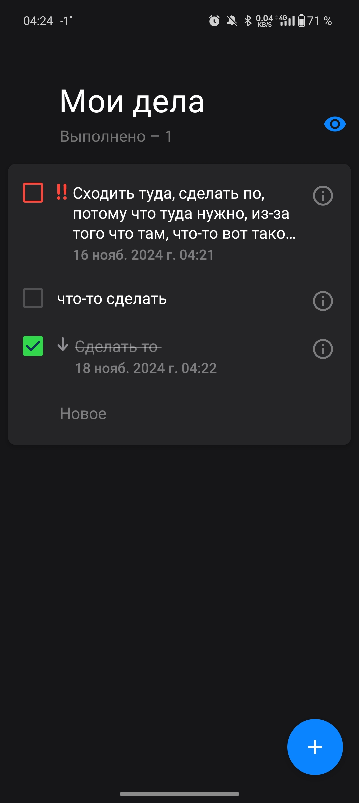
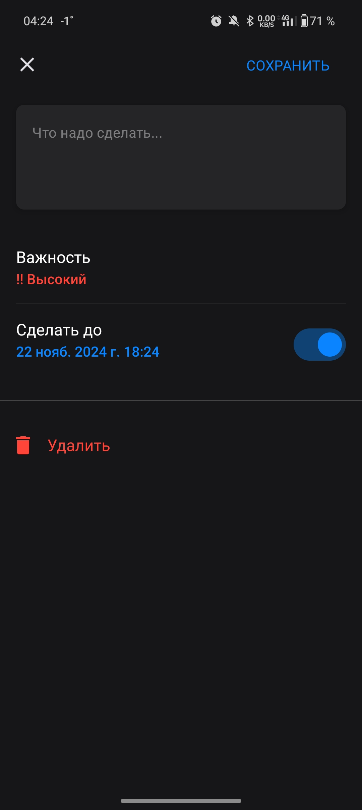
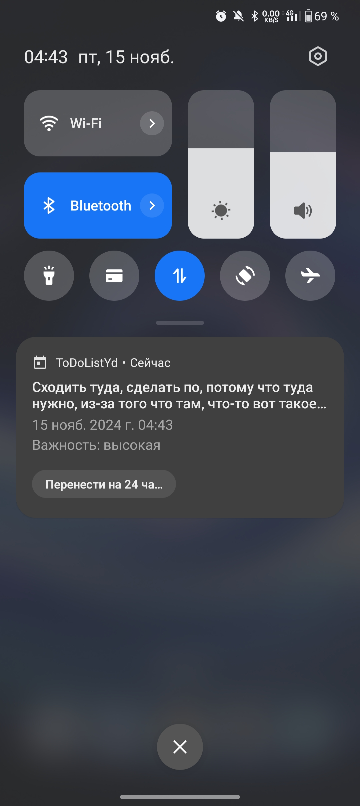

# TodoListYd

**TodoListYd** — это Android-приложение для создания и управления списком задач. Оно разработано для участия в Школе мобильной разработки Яндекса и поддерживает как тёмную, так и светлую темы, обеспечивая удобный интерфейс для отслеживания задач.

## 📱 Скриншоты

### Основной список задач

### Экран добавления/редактирования задачи

### Уведомления

## 🚀 Основные возможности

- **Создание и редактирование задач:** добавление, изменение и удаление задач с возможностью задания дедлайна и приоритетов.
- **Уведомления:** напоминания о предстоящих дедлайнах для эффективного управления задачами.
- **Темы интерфейса:** поддержка светлой и тёмной темы для более комфортного использования приложения.
- **Адаптивный интерфейс:** приложение оптимизировано для работы на различных устройствах.

## ⚙️ Технологический стек

- **Jetpack Compose** — декларативный UI-фреймворк для создания современных интерфейсов.
- **Dagger** и **Dagger Hilt** — внедрение зависимостей.
- **Room** — локальная база данных для хранения задач.
- **WorkManager** — выполнение фоновых задач, таких как напоминания и уведомления.
- **Navigation Component** — управление навигацией между экранами.
- **Coroutines** — библиотека для асинхронных операций и работы с потоками.

## 🗂 Структура проекта

- `app` — основной модуль приложения.
- `todo-uikit` — модуль с пользовательскими интерфейсными компонентами для списка задач.
- `database` — модуль для работы с локальной базой данных (Room).
- `todo-utils` — утилиты для общих функций и вспомогательных классов.
- `domain` — слой с бизнес-логикой.
- `features:todo-list` — экран с основным списком задач.
- `features:todo-add-edit` — экран для добавления и редактирования задач.
- `activity:main-activity-impl` — реализация основной активности.
- `activity:main-activity-api` — интерфейсы для взаимодействия с основной активностью.
- `navigation` — модуль для управления навигацией в приложении.

## 📦 Используемые зависимости

- **AndroidX**: Core KTX, Lifecycle, Activity Compose, Navigation Compose
- **Compose UI**: Material3, UI-тулкиты для разработки интерфейсов
- **Room**: для локального хранения данных
- **Dagger и Hilt**: для внедрения зависимостей
- **Coroutines**: для асинхронного программирования
- **WorkManager**: для фоновых задач
- **Дополнительные библиотеки**: Toolbar Compose, Swipe для свайп-жестов

## 🧩 Пример использования

1. На главном экране приложения вы можете просматривать список всех задач.
2. Для добавления новой задачи нажмите на кнопку «+», укажите название задачи, дедлайн, приоритет и сохраните её.
3. При наступлении дедлайна вы получите уведомление, напоминающее о задаче.
